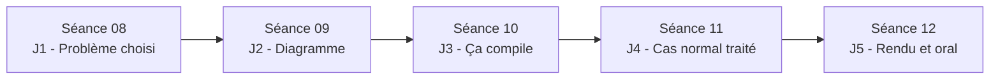

# Mini-projet et jalons

V. Guidoux, avec l'aide de Claude.

Ce travail est sous licence [CC BY-SA 4.0][licence].

## Le principe

Vous choisissez un petit problème de la vraie vie et vous écrivez le programme
qui le résout. Pas un exercice : un problème que vous, ou quelqu'un que vous
connaissez, avez réellement.

Quelques exemples de calibre correct :

- calculer la moyenne d'un ensemble de notes et dire si la moyenne est
  suffisante ;
- répartir les dépenses d'un week-end entre plusieurs personnes et dire qui
  doit combien à qui ;
- suivre la consommation électrique d'un appareil et estimer son coût annuel ;
- gérer une liste d'emprunts d'objets entre voisins ;
- calculer la quantité d'ingrédients d'une recette selon le nombre de
  personnes, avec conversion d'unités.

Le programme fonctionne en ligne de commande, lit des données depuis l'entrée
standard ou depuis un tableau écrit dans le code, et affiche un résultat. Pas
d'interface graphique, pas de base de données, pas de réseau.

## Pourquoi des jalons

Parce que ce cours s'adresse à des personnes qui découvrent la programmation et
que le mode de travail par défaut est de tout faire la veille. Cela ne marche
pas en programmation : on se retrouve devant un écran noir sans savoir par où
commencer, et le temps disponible est déjà écoulé.

Les jalons découpent le projet en étapes où chaque étape produit quelque chose
de visible. Ils sont **validés ou non validés**, jamais notés. Leur seul but
est de garantir que vous ne vous retrouviez pas bloqué en séance 12.

## Les jalons

| Jalon | Échéance  | Ce que vous rendez                                       |
| :---- | :-------- | :------------------------------------------------------- |
| J1    | Séance 08 | Le problème choisi, en cinq lignes, et ce que le programme prend en entrée et produit en sortie |
| J2    | Séance 09 | Le diagramme d'activité de votre solution, dessiné à la main, photographié |
| J3    | Séance 10 | Un programme qui compile et qui affiche quelque chose, même incomplet |
| J4    | Séance 11 | Une version qui résout le cas normal, plus la liste écrite des cas non traités |
| J5    | Séance 12 | Rendu final : code, `README.md`, et présentation orale    |

### Ce que veut dire "validé"

Un jalon est validé s'il est rendu à temps et s'il est honnête, c'est-à-dire
s'il décrit l'état réel de votre travail. Un J3 qui affiche `Hello world` et
rien d'autre est validé si vous le dites. Un J3 qui prétend faire plus que la
réalité ne l'est pas.

### Ce qui se passe si un jalon n'est pas validé

Rien d'automatique sur la note. Mais je vous convoque, on regarde ensemble où
ça coince, et on fixe une nouvelle échéance. Deux jalons consécutifs non rendus
et sans contact de votre part, et je considère que vous abandonnez le
mini-projet, ce qui coûte 50% de la note de l'unité d'enseignement.

## Le rendu final

Votre dépôt contient au minimum :

- le code source, dans des fichiers `.java` lisibles ;
- un fichier `README.md` contenant :
    - le problème traité et pour qui ;
    - comment compiler et lancer le programme ;
    - un exemple d'exécution, avec les entrées et la sortie obtenue ;
    - les limites connues et les cas non traités ;
    - les aides extérieures utilisées, avec quand, pourquoi et comment.

## Critères de qualité du code

Ce qui est regardé, dans cet ordre :

1. Le programme fait ce que le `README.md` annonce.
2. Les noms de variables et de fonctions disent ce qu'ils contiennent ou font.
3. Le code est découpé en fonctions courtes, chacune avec une responsabilité.
4. Le code est indenté de manière cohérente.
5. Les commentaires expliquent pourquoi, pas ce que fait la ligne suivante.

Ce qui n'est pas regardé : l'élégance, la performance, le nombre de
fonctionnalités. Un petit programme simple et compris vaut mieux qu'un gros
programme copié.

## Calendrier

<!-- URLs -->

[licence]:
	https://github.com/heig-vd-progim-course/heig-vd-progim1-course/blob/main/LICENSE.md
