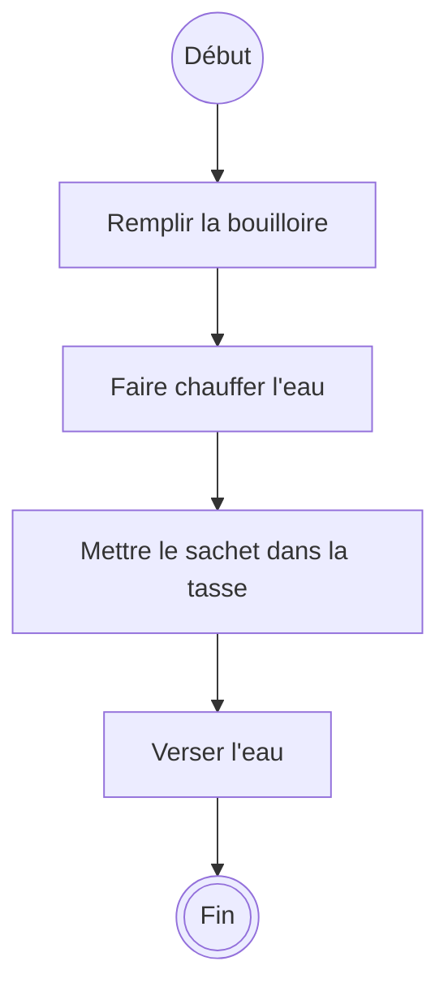
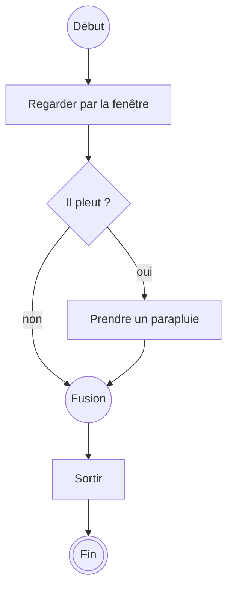
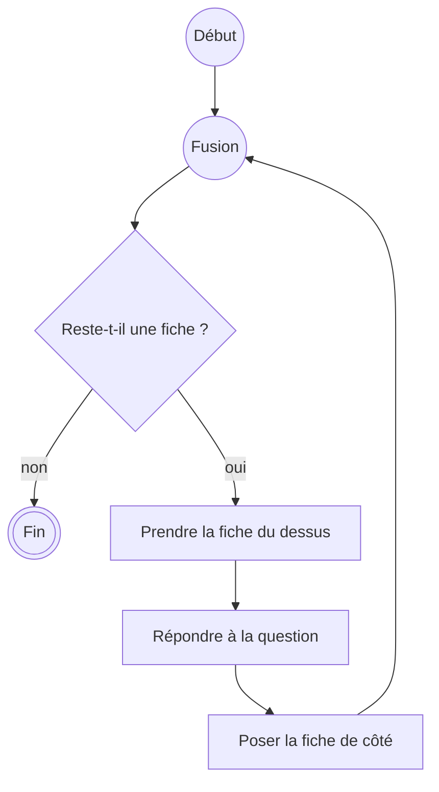

# Les diagrammes d'activité

V. Guidoux, avec l'aide de Claude.

Ce travail est sous licence [CC BY-SA 4.0][licence].

## Pourquoi dessiner

L'activité précédente a montré qu'une suite d'instructions dictée à l'oral part
de travers très vite. Le texte en ligne droite a un défaut : il ne montre pas
les choix, ni les retours en arrière, ni ce qui se passe quand une condition
n'est pas remplie.

Un dessin les montre. C'est tout l'intérêt.

Nous allons utiliser une notation existante et standardisée plutôt que d'en
inventer une : le **diagramme d'activité** de la famille UML.

!!! note "Ce que nous n'allons pas faire"

    UML comporte quatorze types de diagrammes et plusieurs centaines de
    symboles. Nous en utilisons six. Le reste ne nous sera d'aucune utilité
    cette année, et une bonne partie ne vous servira jamais.

    Nous n'utiliserons pas non plus d'outil de génération de diagrammes. Vous
    dessinez à la main, sur papier. Un diagramme se fait en trente secondes au
    crayon et en vingt minutes avec un outil, et celui au crayon est presque
    toujours meilleur, parce qu'on ose le jeter.

## Les six symboles

| Symbole                          | Nom              | Ce qu'il veut dire                     |
| :------------------------------- | :--------------- | :------------------------------------- |
| Disque noir plein                | Nœud initial     | Ici commence l'activité                |
| Rectangle aux coins arrondis     | Action           | On fait quelque chose                  |
| Flèche                           | Transition       | Puis on passe à la suite               |
| Losange avec une entrée          | Décision         | On pose une question, on choisit       |
| Losange avec plusieurs entrées   | Fusion           | Les chemins se rejoignent              |
| Disque noir cerclé               | Nœud final       | Ici l'activité se termine              |

Deux règles de lecture suffisent :

1. Une flèche qui part d'une décision porte toujours une **condition** écrite
   entre crochets, par exemple `[il pleut]` et `[sinon]`.
2. Depuis une décision, un seul chemin est emprunté. Depuis une fusion, on
   repart sur un seul chemin.

## Un premier exemple - une séquence

Faire du thé, sans aucun choix :

C'est une **séquence** : une action après l'autre, sans surprise. Notez que
l'ordre est porteur de sens. Verser l'eau avant de mettre le sachet donne un
autre thé.

## Deuxième exemple - une décision

Sortir de chez soi :

Le losange pose une question à laquelle on peut répondre. Les deux chemins se
rejoignent ensuite sur un nœud de fusion, puis l'activité continue.

Une erreur fréquente, à éviter : oublier le chemin `[non]`. Une décision sans
sortie pour le cas contraire est un programme qui s'arrête sans raison.

## Troisième exemple - une répétition

Réviser une pile de fiches jusqu'à ce qu'il n'y en ait plus :

La flèche qui remonte est une **répétition**, aussi appelée itération. Deux
choses à vérifier systématiquement sur ce type de diagramme :

- la condition de sortie existe ;
- quelque chose change à chaque tour, sans quoi la condition de sortie ne sera
  jamais vraie.

Si vous ne retirez pas la fiche de la pile, vous relisez la même fiche
indéfiniment. En programmation, cela s'appelle une boucle infinie, et c'est
l'une des deux erreurs que vous ferez le plus souvent cette année.

## Séquence, sélection, itération

Ces trois exemples ne sont pas choisis au hasard. Tout programme, quel qu'il
soit et dans n'importe quel langage, est construit avec ces trois structures et
rien d'autre :

- la **séquence** : faire ceci, puis cela ;
- la **sélection** : selon la situation, faire ceci ou cela ;
- l'**itération** : répéter tant qu'une condition tient.

C'est un résultat démontré, pas une convention pédagogique : c'est le théorème
de Böhm-Jacopini, publié en 1966. Retenez-le : quand un programme vous paraîtra
incompréhensible, il sera toujours réductible à ces trois formes.

## Comment dessiner proprement

- Un verbe à l'infinitif par action : _"Calculer la moyenne"_, pas
  _"Moyenne"_.
- Une seule action par rectangle. Si votre rectangle contient un "et", coupez.
- Une question fermée dans chaque losange, avec toutes ses réponses en sortie.
- De haut en bas. Les retours en arrière sont les seules flèches qui remontent.
- Au crayon. Vous allez raturer, et c'est normal.

## Les erreurs classiques

| Erreur                                     | Conséquence                              |
| :----------------------------------------- | :--------------------------------------- |
| Une décision sans chemin pour le cas `non` | Le lecteur ne sait pas quoi faire        |
| Une action formulée comme un état          | On ne sait pas ce qu'il faut exécuter    |
| Une boucle sans condition de sortie        | L'activité ne se termine jamais          |
| Deux actions dans un même rectangle        | On ne peut plus situer une erreur        |
| Aucun nœud final                           | On ne sait pas quand on a terminé        |

## À vous

Dessinez, sur papier, le diagramme d'activité de l'une de ces situations :

1. Retirer de l'argent à un bancomat.
2. Décider de prendre le bus ou d'y aller à pied.
3. Chercher un livre précis dans une bibliothèque, rayon par rayon.

Comparez ensuite avec la personne à côté de vous. Les deux diagrammes seront
différents et les deux pourront être corrects : il n'existe pas une seule bonne
réponse, seulement des réponses exécutables et des réponses ambiguës.

<!-- URLs -->

[licence]:
	https://github.com/heig-vd-progim-course/heig-vd-progim1-course/blob/main/LICENSE.md
