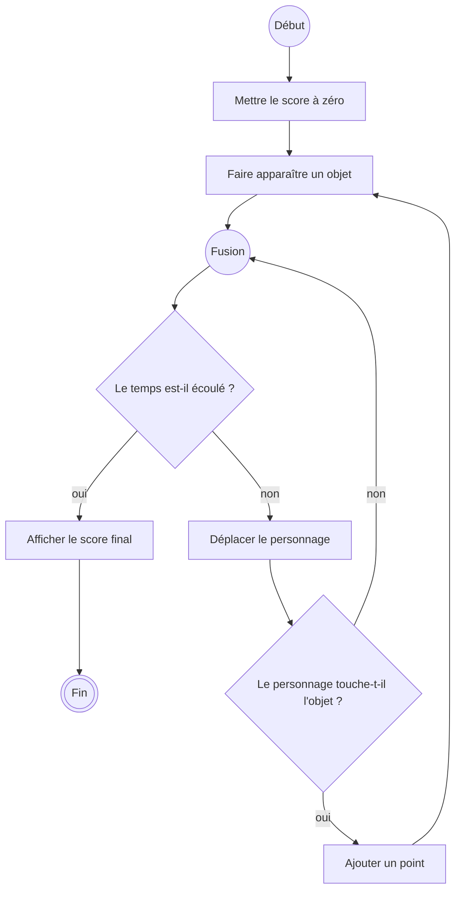

# Phase 3 - Créer

V. Guidoux, avec l'aide de Claude.

Ce travail est sous licence [CC BY-SA 4.0][licence].

## Objectif de la phase

Partir d'une page blanche, dessiner ce que vous voulez obtenir, puis le
construire.

## La règle

**Le diagramme d'abord. L'éditeur ensuite.**

Vous dessinez le diagramme d'activité de votre jeu sur papier, vous me le
montrez, et seulement après vous ouvrez l'éditeur.

Ce n'est pas une formalité administrative. C'est la seule manière de vérifier
que vous savez ce que vous voulez faire avant de commencer à le faire.
Quiconque ouvre l'éditeur en premier passera la phase à empiler des blocs au
hasard et repartira avec quelque chose qui bouge sans savoir pourquoi.

## Déroulé

| Temps  | Étape                                                       |
| -----: | :----------------------------------------------------------- |
| 10 min | Choisir un sujet et écrire ses règles en trois phrases       |
| 10 min | Dessiner le diagramme d'activité d'une partie                 |
| 30 min | Construire dans l'éditeur                                     |
|  5 min | Se préparer à la restitution croisée                          |

## Choisir un sujet

Cinq sujets calibrés pour tenir en trente minutes. Prenez-en un, ou proposez le
vôtre à condition qu'il soit du même calibre.

### 1. Le ramasseur

Un personnage se déplace. Des objets apparaissent à des endroits aléatoires.
Toucher un objet donne un point. La partie dure trente secondes.

### 2. L'esquive

Un personnage se déplace de gauche à droite en bas de l'écran. Des objets
tombent du haut. Toucher un objet fait perdre une vie. Trois vies.

### 3. Le tri

Deux zones à l'écran, une à gauche et une à droite. Des objets de deux couleurs
apparaissent au centre. Les pousser dans la bonne zone donne un point, dans la
mauvaise en retire un.

### 4. Le chronomètre

Un chiffre s'affiche. La personne doit appuyer sur A exactement au bout de cinq
secondes, sans compteur visible. Le score est l'écart en dixièmes.

### 5. La mémoire

Trois couleurs s'allument dans un ordre donné. La personne doit reproduire
l'ordre avec les boutons. La séquence s'allonge d'un cran à chaque réussite.

!!! warning "Le piège de cette phase"

    Votre sujet vous paraîtra trop simple et vous aurez envie d'ajouter des
    niveaux, des ennemis, une histoire.

    Ne le faites pas. Faites d'abord fonctionner la version minimale, de bout
    en bout, avec un début et une fin. Vous ajouterez ensuite s'il reste du
    temps, ce qui ne sera pas le cas.

    Cette envie reviendra au mini-projet, en séance 08. Elle y coûtera
    beaucoup plus cher.

## Le diagramme attendu

Un diagramme d'activité d'**une partie**, avec les six symboles de la séance
01 :

- un nœud initial et un nœud final ;
- les actions, un verbe chacune ;
- au moins une décision, avec ses deux sorties ;
- au moins une répétition, avec sa condition de sortie.

Ajoutez à côté, en liste, ce que le programme doit retenir : le score, le
nombre de vies, le temps restant. Ce sont vos variables. Le fait de les écrire
avant de commencer vous évitera d'en découvrir une au milieu de la
construction.

Exemple de la forme attendue, pour le ramasseur :

Votre diagramme n'a pas à ressembler à celui-ci. Il doit ressembler à votre
jeu.

## Construire

Une fois le diagramme validé, ouvrez l'éditeur. Procédez dans cet ordre :

1. Le personnage apparaît et se déplace. Testez.
2. Les objets apparaissent. Testez.
3. La collision donne un point. Testez.
4. La partie se termine. Testez.
5. Le score s'affiche. Testez.

Chaque étape doit fonctionner avant de passer à la suivante. Si l'étape 3 ne
marche pas, ne construisez pas l'étape 4 en espérant que l'ensemble finisse par
tomber juste : il ne le fera pas, et vous aurez alors deux problèmes.

## Quand vous êtes bloqué

Dans l'ordre, et pas dans un autre :

1. Relisez votre diagramme. Neuf fois sur dix, l'étape qui manque y est
   absente aussi.
2. Regardez la [documentation des blocs](https://arcade.makecode.com/reference)
   pour la catégorie qui vous intéresse.
3. Demandez à la personne à côté de vous de dire à voix haute ce qu'elle
   comprend de votre programme.
4. Appelez-moi.

Cet ordre est volontaire. La quatrième option est la plus rapide sur le moment
et la moins utile sur le semestre.

## Notes pour l'équipe enseignante

### Validation des diagrammes

Le passage de validation est le goulot d'étranglement : avec vingt personnes,
il faut tenir une minute par diagramme. Deux questions suffisent :

1. _"Montre-moi où la partie se termine."_
2. _"Qu'est-ce que ton programme doit retenir ?"_

Un diagramme sans fin ou sans variable identifiée repart pour deux minutes.

### Choix de sujets

Les sujets 4 et 5 sont plus difficiles qu'ils n'en ont l'air : le chronomètre
demande de manipuler le temps, la mémoire demande une liste. Les laisser
disponibles pour les personnes qui avancent vite, mais ne pas les recommander
d'emblée.

### Pendant la construction

- Circuler en regardant les écrans plutôt qu'en attendant les mains levées.
  Une personne bloquée depuis dix minutes ne lève pas la main.
- Résister à la tentation de prendre la souris. Décrire le bloc à chercher,
  pas le poser.
- Noter qui termine en avance : ces personnes animent la restitution croisée.

### Le débriefing final

Cinq minutes, sur une seule question : **qu'est-ce que les blocs vous ont
empêché de faire ?**

Les réponses attendues, à faire émerger plutôt qu'à énoncer :

- on ne peut pas chercher un mot dans son programme ;
- on ne peut pas copier une partie du programme dans un message pour demander
  de l'aide ;
- on ne peut pas voir ce qui a changé entre hier et aujourd'hui ;
- on ne peut pas travailler à deux sur le même programme ;
- au-delà d'un écran, on ne retrouve plus rien.

Ces cinq limites sont exactement les raisons pour lesquelles le code
professionnel est du texte. C'est la transition vers la séance 03 ; ne pas la
donner maintenant, l'annoncer.

<!-- URLs -->

[licence]:
	https://github.com/heig-vd-progim-course/heig-vd-progim1-course/blob/main/LICENSE.md
