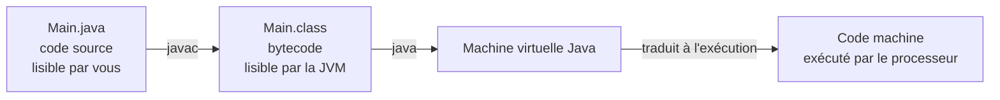

# La machine virtuelle et la compilation

V. Guidoux, avec l'aide de Claude.

Ce travail est sous licence [CC BY-SA 4.0][licence].

## La question de départ

Vous venez de cliquer sur une flèche verte et du texte est apparu. Entre les
deux, il s'est passé beaucoup de choses.

Cette page répond à une question : **qu'est-ce qui lit ce que j'écris, et
comment cela finit-il par être exécuté ?**

Ce n'est pas de la culture générale. C'est ce qui vous permettra de comprendre
pourquoi certaines erreurs apparaissent avant que le programme ne démarre et
d'autres pendant qu'il tourne, et de savoir laquelle vous venez de commettre.

## Une machine ne comprend qu'une chose

Un processeur n'exécute que du **code machine** : des suites de nombres qui
correspondent à des opérations très élémentaires. Additionner deux registres.
Lire une case mémoire. Sauter à une autre instruction.

Personne n'écrit cela à la main depuis les années 1950. On écrit du texte dans
un langage lisible, et un programme se charge de la traduction.

Deux grandes familles de traduction existent.

### La compilation

Un programme appelé **compilateur** lit tout votre code source et produit, une
fois pour toutes, un fichier exécutable en code machine.

- La traduction a lieu **avant** l'exécution.
- Le compilateur refuse de produire quoi que ce soit si votre code est
  incohérent : c'est une **erreur de compilation**.
- L'exécutable produit est rapide, et lié à un système et à un processeur
  précis.

C'est le modèle du C et du C++.

### L'interprétation

Un programme appelé **interpréteur** lit votre code ligne par ligne et exécute
chaque instruction au fur et à mesure.

- La traduction a lieu **pendant** l'exécution.
- Rien n'est vérifié à l'avance : une faute à la ligne 200 ne se révèle que
  lorsque le programme y arrive.
- C'est plus lent, et le même fichier fonctionne partout où l'interpréteur est
  installé.

C'est le modèle de Python et de JavaScript.

### Java fait les deux



Java compile votre code source, mais **pas en code machine**. Il le compile en
**bytecode** : un langage intermédiaire, qui n'est lisible ni par vous ni par
votre processeur, et qui est exactement le même quel que soit votre système.

Ce bytecode est ensuite exécuté par la **machine virtuelle Java**, la JVM, qui
le traduit en code machine au moment de l'exécution.

## Pourquoi s'embêter avec une étape de plus

Parce que cela règle un vrai problème : **un seul fichier compilé fonctionne
partout**.

Le même `.class` tourne sur votre portable Windows, sur le Mac de la personne à
côté de vous et sur un serveur Linux, sans être recompilé. C'est ce que Java
appelle depuis 1995 _"write once, run anywhere"_ : écrire une fois, exécuter
partout.

Ce n'est pas la JVM qui est portable. C'est votre programme qui le devient,
parce qu'il existe une JVM pour chaque plateforme et que toutes comprennent le
même bytecode.

Accessoirement, la JVM observe votre programme pendant qu'il tourne et
recompile en code machine optimisé les portions les plus utilisées. C'est
pourquoi un programme Java est souvent lent pendant sa première seconde, puis
rapide.

## JDK, JRE, JVM

Trois sigles qu'on confond tout le temps.

| Sigle | Nom                      | Contient                                       | Pour qui                        |
| :---- | :----------------------- | :--------------------------------------------- | :------------------------------ |
| JVM   | Java Virtual Machine     | Le moteur qui exécute le bytecode               | Personne ne l'installe seule    |
| JRE   | Java Runtime Environment | La JVM et les bibliothèques de base             | Qui veut **exécuter** du Java   |
| JDK   | Java Development Kit     | Le JRE, plus le compilateur `javac` et les outils | Qui veut **écrire** du Java   |

Vous avez installé un **JDK**, parce que vous écrivez du code. Une personne qui
veut seulement lancer un jeu écrit en Java n'a besoin que d'un JRE.

Retenez l'emboîtement : JDK contient JRE, qui contient JVM.

## Le faire à la main, une fois

L'IDE fait tout d'un clic, ce qui est confortable et qui cache tout. Faisons-le
une fois en ligne de commande, pour voir les deux étapes séparément.

Dans un terminal, dans un dossier vide, créez un fichier `Bonjour.java` :

```java
public class Bonjour {
    public static void main(String[] args) {
        System.out.println("Bonjour tout le monde");
    }
}
```

Compilez :

```sh
javac Bonjour.java
```

Rien ne s'affiche. C'est bon signe : en informatique, le silence veut souvent
dire que tout s'est bien passé. Listez le dossier, un fichier `Bonjour.class`
est apparu. C'est le bytecode.

Exécutez-le :

```sh
java Bonjour
```

```text
Bonjour tout le monde
```

Remarquez : `java Bonjour`, sans l'extension. Vous ne donnez pas un fichier à
la JVM, vous lui donnez le **nom d'une classe** à charger.

??? note "Regarder le bytecode, pour la curiosité"

    ```sh
    javap -c Bonjour.class
    ```

    Vous obtenez une suite d'instructions du type `getstatic`, `ldc`,
    `invokevirtual`. C'est ce que lit la JVM. Vous n'avez pas à le comprendre,
    et vous n'y reviendrez probablement jamais. L'intérêt est de constater que
    cela existe, et que ce n'est ni votre texte ni du code machine.

## Les deux moments où ça casse

C'est le point à retenir de cette page.

### Erreur de compilation

Elle survient **avant** que le programme ne démarre. Le compilateur a refusé de
traduire.

```java
public class Casse {
    public static void main(String[] args) {
        System.out.println("Bonjour")
    }
}
```

```text
Casse.java:3: error: ';' expected
        System.out.println("Bonjour")
                                     ^
1 error
```

Le message donne le fichier, la ligne, la colonne et la nature du problème.
Rien ne s'est exécuté.

!!! tip "Lisez le message en entier, et commencez par le premier"

    Les erreurs de compilation arrivent souvent en paquet, et la plupart sont
    les conséquences de la première. Corrigez celle du haut, recompilez,
    regardez ce qu'il reste. Vous verrez régulièrement douze erreurs se
    réduire à une.

### Erreur à l'exécution

Elle survient **pendant** que le programme tourne. Le code était cohérent, mais
la situation rencontrée ne l'était pas.

```java
public class Casse {
    public static void main(String[] args) {
        int total = 15;
        int nombre = 0;
        System.out.println(total / nombre);
    }
}
```

```text
Exception in thread "main" java.lang.ArithmeticException: / by zero
	at Casse.main(Casse.java:5)
```

Le programme a démarré, affiché ce qui précédait, puis s'est arrêté net. Le
compilateur n'avait rien à redire : diviser un entier par un autre est une
opération parfaitement légale. C'est la valeur rencontrée qui ne l'était pas.

### La distinction qui compte

| | Erreur de compilation | Erreur à l'exécution |
| :--- | :--- | :--- |
| Quand | Avant le démarrage | Pendant le fonctionnement |
| Détectée par | Le compilateur `javac` | La machine virtuelle |
| Le programme a tourné | Non | Oui, jusqu'au point de rupture |
| Exemple typique | Point-virgule manquant, type incompatible | Division par zéro, fichier absent |
| Coût | Faible : vous la voyez tout de suite | Élevé : elle peut n'apparaître que chez l'utilisateur |

Un langage compilé et strict comme Java **déplace des erreurs de la seconde
colonne vers la première**. C'est pour cela qu'il est verbeux, et c'est son
principal intérêt pour apprendre.

!!! warning "Un message d'erreur n'est pas une punition"

    C'est une information, souvent précise, souvent exacte. La réaction utile
    est de le lire. La réaction fréquente est de le fermer et de modifier du
    code au hasard.

    En séance 02, vous avez cherché un bogue sans aucun message. Ici, vous
    avez le fichier, la ligne et la nature du problème. C'est un luxe.

## Un mot sur le ramasse-miettes

Dans certains langages, il faut réserver la mémoire dont on a besoin puis la
rendre explicitement. L'oublier fait gonfler le programme jusqu'à saturation.

Java s'en charge : un processus appelé **ramasse-miettes**, ou _garbage
collector_, tourne en arrière-plan et libère la mémoire occupée par ce qui
n'est plus utilisé.

Vous n'avez rien à faire. Retenez simplement que c'est un service que vous rend
la JVM, et l'une des raisons pour lesquelles elle existe.

## Résumé

- Un processeur n'exécute que du code machine.
- Compiler, c'est traduire avant d'exécuter. Interpréter, c'est traduire
  pendant.
- Java compile en **bytecode**, un intermédiaire indépendant de la machine.
- La **JVM** exécute ce bytecode, ce qui rend le programme portable.
- **JDK** contient **JRE**, qui contient **JVM**.
- Une erreur de compilation empêche le programme de démarrer ; une erreur
  d'exécution l'interrompt en cours de route.

## Pour aller plus loin

- [Documentation officielle Java](https://docs.oracle.com/en/java/javase/) -
  la référence.
- [dev.java](https://dev.java/learn/) - les tutoriels officiels, plus
  abordables.
- Le chapitre
  [Java, IntelliJ IDEA and Maven](https://github.com/heig-vd-dai-course/heig-vd-dai-course/tree/main/01.04-java-intellij-idea-and-maven)
  du cours DAI de L. Delafontaine, qui va plus loin sur les mêmes notions.

<!-- URLs -->

[licence]:
	https://github.com/heig-vd-progim-course/heig-vd-progim1-course/blob/main/LICENSE.md
